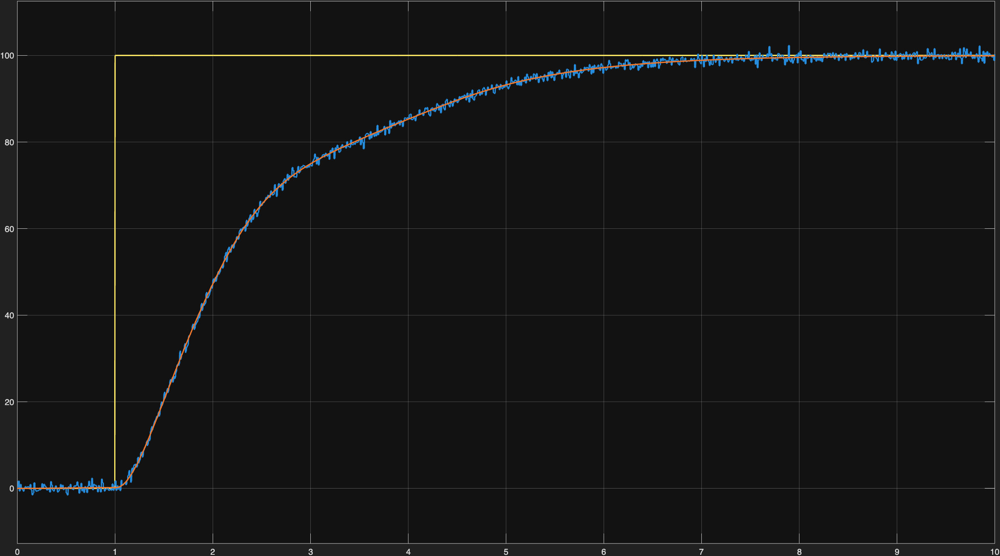

# Turbofan Engine FADEC Control System Simulation

This project presents a high-fidelity **Simulink** model for a **FADEC (Full Authority Digital Engine Control)** system, designed to regulate the N1 speed of a turbofan engine using advanced control techniques.

## Project Overview
The simulation focuses on regulating engine speed (**N1**) through various operating points while accounting for real-world flight conditions, such as measurement noise and system non-linearities.

## Key Technical Features
* **State-Space Modeling:** Engine dynamics implemented using linearized matrices (A, B, C, D) for accurate transient response.
* **Gain-Scheduled PI Control:** Adaptive control parameters (P and I) that adjust dynamically based on engine RPM to ensure stability across the entire power range.
* **Kalman Filter Integration:** Real-time state estimation used to filter out **White Noise** and provide a clean feedback signal to the controller.
* **Robust Design:** Implementation of anti-windup logic and critically damped response to prevent engine overspeed.

## Mathematical Framework

### 1. Engine Dynamics
The turbofan's behavior is modeled using a linearized state-space representation:

$$\dot{x} = Ax + Bu$$
$$y = Cx + Du$$

Where **$x$** represents internal engine states, **$u$** is the fuel flow command, and **$y$** is the measured N1 Fan Speed (%).

### 2. Control Law
The system utilizes a **Gain-Scheduled PI Controller**. The control signal is calculated as:

$$u(t) = K_p(N1) \cdot e(t) + K_i(N1) \int e(t) dt$$

The gains $K_p$ and $K_i$ are interpolated based on the current N1 speed to handle the engine's non-linear behavior.

### 3. Noise Mitigation
A **Discrete-time Kalman Filter** provides an optimal estimate ($\hat{x}$) of the true engine speed by balancing process disturbances and sensor noise:

$$\hat{x}_{k|k} = \hat{x}_{k|k-1} + L(y_k - C\hat{x}_{k|k-1})$$

## Performance Results
The system was validated using an automated MATLAB script, yielding the following results for a 100% N1 step command:

### N1 Step Response

### Simulink Model Architecture

## Repository Structure
* `Engine_Control_System.slx`: The main Simulink block diagram.
* `init_params.m`: Script to initialize engine matrices and PID maps.
* `verify_performance.m`: Automated validation script for performance reporting.

## How to Run
1. Run `init_params.m` to load matrices and controller gains into the Workspace.
2. Open and run `Engine_Control_System.slx`.
3. Execute `verify_performance.m` to generate the final performance report.

---
*Project developed for Aerospace Engineering applications.*
